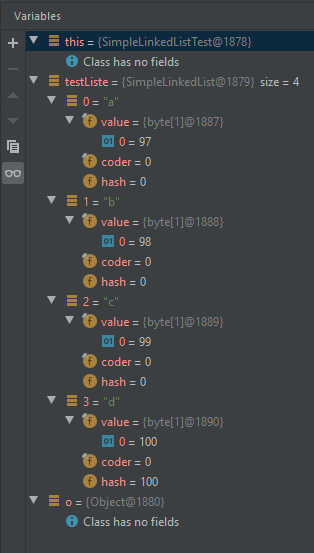

# swt2-komplex-3

Genutzte IDE: IntelliJ IDEA 

## Aufgabe 3:
- Überführung in Maven Projekt gemäß der Dokumentation:
  https://www.jetbrains.com/help/idea/convert-a-regular-project-into-a-maven-project.html

## Aufgabe 4:
- Konfiguration gemäß Dokumentation: https://www.jetbrains.com/help/idea/junit.html
- Änderungen an pom.xml --> Einfügen der Dependency für jUnit 5
- Erstellen eines Test-Ordners
- Testordner als Test Source Root markieren

## Aufgabe 5:
- Wie?: in der Testkonfiguration >> Code Coverage >> Jacoco
- Welche Arten?: prüfen beide Run-Code auf Testcode-Abdeckung

## Aufgabe 6:
- Gefundene Fehler:
  - Zeile 34: fehlendes Semikolon
  - Zeile 54: hasNext prüft auf current und nicht auf next
  - Erster Aufruf von Iter.next() gibt nun tatsächlich das erste Element zurück
    - siehe Commits: "6a7f466" und "dc22fc8"

## Aufgabe 7:
- Zeile 61:
  - Bad practice:
    - wenn Iterator kein nächstes Element hat, sollte eher eine "NoSuchElementException"
      geworfen werden anstatt NULL zurück zugeben  
- Zeile 34:
  - Dodgy Code:
    - Syntax-Error da fehlendes Semikolon

## Aufgabe 8:

Variables View mit einer Beispielliste mit 4 Elementen ("a", "b", "c", "d"):

